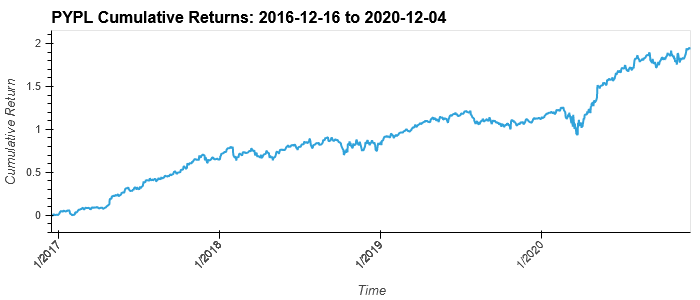
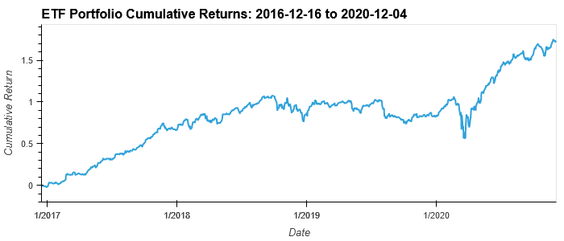

# etf_analyzer
Financial database and web application using SQL, Python, and Voila to analyze the performance of a hypothetical FinTech ETF.

**The application is a github project. [here](https://github.com/avangelinac/etf_analyzer)

---
## Installation Instructions
- ### Install [Selenium](https://selenium-python.readthedocs.io/) to use [bokeh.io](https://docs.bokeh.org/en/latest/) image export functions
```shell
conda install selenium
```
and
```shell
conda install -c conda-forge firefox geckodriver
```
- ### To publish this notebook as HTML use [Voila](https://voila.readthedocs.io/en/stable/index.html):
```shell 
conda install -c conda-forge voila
```

---
## Usage
To run the notebook from the command line use:
```shell
voila etf_analyzer.ipynb
```

---
## Examples




---
## Contributors
Initial contribution Avangelina Cazares. Open source.

---
## License
None.